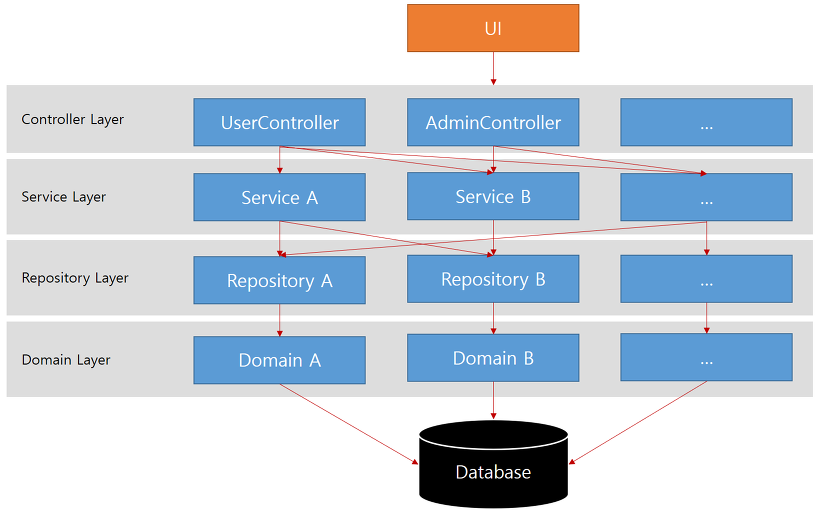

# 아키텍처, 개발 환경, 프로젝트 구조

## 아키텍처

- Controller Layer : UI에서 요청을 받고 응답을 전달
- Service Layer : 비즈니스 로직을 구현
- Repository Layer : 데이터베이스에서 가져올 쿼리를 구현, JPA를 이용하는 경우 정해진 규칙에 따라서 메소드를 사용하거나, 만들어 놓으면 적절한 쿼리를 수행
- Domain Layer : 실제로 데이터베이스 물리 테이블과 1:1 매핑이 되어 바인되어 있다.

Controller에서는 Service를 호출해서 받은 결과를 UI에 전달
[Service -> Repository -> Domain]처럼 각각 관련 있는 클래스를 호출하도록 설계
Service가 또 다른 Service를 호출하지 않도록하고, Service에서 필요한 Repository에 접근하여 데이터를 가져올 수 있도록 한다.

## 개발 환경
Framework
    - Spring Boot 2.0.6
        - Tomcat
        - JPA (Java Pesistance API)
        - lombok

Template Engine
- Thymeleaf

Javasript
- jQuery

UI
- Bootstrap & Bootstrap LTE

Database
- MySQL 5.7

## 프로젝트 구조
```sh
└─blog
  ├─src.main.java
  │    ├─project.blog
  │    ├─project.blog.common
  │    ├─project.blog.config
  │    ├─project.blog.controller
  │    ├─project.blog.domain
  │    ├─project.blog.dto
  │    ├─project.blog.repository
  │    ├─project.blog.service
  │    └─project.blog.BlogApplication
  ├─src.test.java
  ├─src.main.resources
  │    ├─template
  │    ├─static
  │    └─application.yml
  ├─build.gradle
  └─init.mysql.sql

```