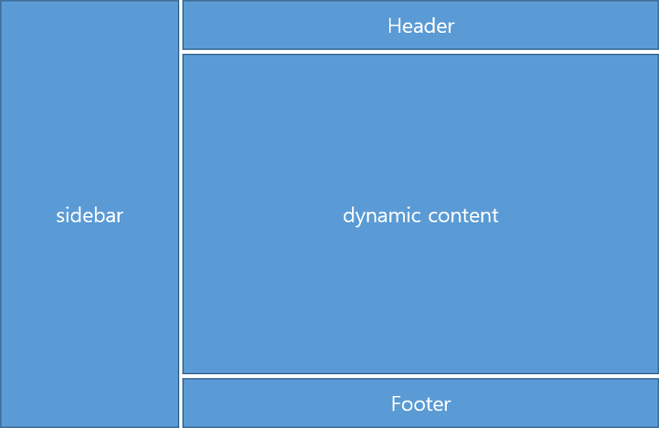

# index 페이지 작성 - UI 레이아웃 [Bootstrap + Thymeleaf]

Front-End 부분인 User Interface(UI)를 구성<br>
BootStrap을 이용하여 html + CSS 부분을 구성할 것, Template Engine 중 하나인 Thymeleaf를 사용하여, 서버와 통신할 수 있도록 할 것<br>

## Dependencies
Gradle 설정 파일인 build.gradle 의 dependencies 부분에 기본적으로 필요한 라이브러리 들을 설정
> build.gradle
```
plugins {
	id 'org.springframework.boot' version '2.3.8.RELEASE'
	id 'io.spring.dependency-management' version '1.0.11.RELEASE'
	id 'java'
}

group = 'project'
version = '0.0.1-SNAPSHOT'
sourceCompatibility = '11'

repositories {
	mavenCentral()
}

dependencies {
	implementation 'org.springframework.boot:spring-boot-starter-web'
	implementation 'org.springframework.boot:spring-boot-starter-thymeleaf'
	implementation 'org.springframework.boot:spring-boot-devtools'
	testImplementation('org.springframework.boot:spring-boot-starter-test') {
		exclude group: 'org.junit.vintage', module: 'junit-vintage-engine'
	}
}

test {
	useJUnitPlatform()
}

```
dependencies 설명
- spring-boot-starter-web : SpringMVC를 사용하는 RESTful 애플리케이션을 포함한 웹 구축 용 스타터 구성을 포함하고 있고, Tomcat을 기본 임베디드 컨테이너로 사용
- spring-boot-starter-thymeleaf : Thymeleaf 뷰를 사용하여 MVC 웹 응용 프로그램을 작성하기 위한 의존성
- spring-boot-devtools : 빠른 개발을 위해서 소스 수정 시 컴파일 후 즉시 반영되어 변경된 사항을 확인 가능, 핫 스왑 모드 지원
- spring-boot-starter-test : Spring Boot 어플리케이션을 테스트하기 위한 스타터 구성

---
## 레이아웃 구성


sidebar : 메뉴를 담고 있는 영역<br>
Header : 이미지 및 타이틀 표현하는 여역<br>
Dynamic Content : 메인 내용을 표현하는 영역, 메뉴에서 선택 시 선택한 메뉴에 따라서 변경되는 영역<br>
Footer : 저자, 작성 날짜 등의 내용을 표현하는 영역<br>

---

## 소스

> index.html

```html
<!DOCTYPE html>
<html lang="ko" xmlns:th="http://www.thymeleaf.org">
<head>
    <meta charset="utf-8">
    <meta name="viewport" content="width=device-width, initial-scale=1, shrink-to-fit=no">
    <meta name="context-path" th:content="@{/}"/>
    
    <title>HM & SB Blog</title>
    
    <!--  Common header -->
    <th:block th:include="common/include-link"></th:block>
    <!-- Custom styles for sidebar -->
    <link th:href="@{/css/sidebar.css}" rel="stylesheet">
</head>
<body>
    <!-- Common script -->
    <th:block th:include="common/include-script"></th:block>
 
    <div class="wrapper">
        <!-- Side Bar -->
        <nav th:replace="common/common-sidebar"></nav>
        <div id="content">
            <!-- Page Header -->
            <header th:replace="common/common-header"></header>
            
            <!-- Main Content -->
            <div th:replace="${template}"></div>
            
            <hr>
            
            <!-- Footer -->
            <footer th:replace="common/common-footer"></footer>
        </div>
    </div>
    
</body>
</html>

```

### 설명
- `<th:block th:include="common/include-link"></th:block>` : 공통으로 사용할 CSS모음<br>
    상세내용
    ```
    <!-- Bootstrap core CSS -->
    <link th:href="@{/webjars/bootstrap/4.1.3/css/bootstrap.min.css}" rel="stylesheet">
    
    <!-- Custom common css -->
    <link th:href="@{/css/common.css}" rel="stylesheet">
    
    <!-- Custom styles for this template -->
    <link th:href="@{/css/clean-blog.css}" rel="stylesheet">
    ```
- `<th:block th:include="common/include-script"></th:block>` : 공통으로 사용할 Script 모음 <br>
    상세내용
    ```
    <!-- Bootstrap core JavaScript -->
    <script th:src="@{/webjars/jquery/3.3.1/js/jquery.min.js}"></script>
    <script th:src="@{/webjars/bootstrap/4.1.3/js/bootstrap.bundle.min.js}"></script>
    
    <!-- Custom scripts for this template -->
    <script th:src="@{/js/clean-blog.min.js}"></script>
    
    <!-- Common Custom script -->
    <script th:src="@{/js/common.js}"></script>
    ```
- 메인 부분
    - `<nav th:replace="common/common-sidebar"></nav>` : 사이드바 영역<br>
    상세내용
    ```
    <nav th:fragment="common-sidebar" id="sidebar">
        <div class="sidebar-header">
            <h3><a th:href="@{/}">Category</a></h3>
        </div>
        <ul id="category" class="list-unstyled components">
        </ul>    
    </nav>

    ```
    - `<header th:replace="common/common-header"></header>` : 헤더 영역 <br>
    상세내용
    ```
    <header th:fragment="common-header" class="masthead" th:style="'background:url(' + @{/image/main-bg.jpg} + ');'">
        <button type="button" id="sidebarCollapse" class="btn btn-default">
            <i id="sidebarCollapseBtn" class="fas fa-angle-left"></i>
        </button>
        <div class="overlay"></div>
        <div class="container">
            <div class="row">
                <div class="col-lg-8 col-md-10 mx-auto">
                    <div class="site-heading">
                        <h1>HM & SB Blog</h1>
                        <span class="subheading">A Blog Theme by Start Bootstrap</span>
                    </div>
                </div>
            </div>
        </div>
    </header>
    ```
    - `<div th:replace="${template}"></div>` : 메뉴 선택에 따라서 동적으로 변경하는 영역 <br>
    - `<footer th:replace="common/common-footer"></footer>` : 푸터영역 <br>
    상세내용
    ```
    <footer th:fragment="common-footer">
        <div class="container">
            <div class="row">
                <div class="col-lg-8 col-md-10 mx-auto">
                    <ul class="list-inline text-center">
                        <li class="list-inline-item"><a href="#"> <span class="fa-stack fa-lg"> <i
                                    class="fas fa-circle fa-stack-2x"></i> <i class="fab fa-twitter fa-stack-1x fa-inverse"></i>
                            </span>
                        </a></li>
                        <li class="list-inline-item"><a href="#"> <span class="fa-stack fa-lg"> <i
                                    class="fas fa-circle fa-stack-2x"></i> <i class="fab fa-facebook-f fa-stack-1x fa-inverse"></i>
                            </span>
                        </a></li>
                        <li class="list-inline-item"><a href="#"> <span class="fa-stack fa-lg"> <i
                                    class="fas fa-circle fa-stack-2x"></i> <i class="fab fa-github fa-stack-1x fa-inverse"></i>
                            </span>
                        </a></li>
                    </ul>
                    <p class="copyright text-muted">Copyright &copy; Happygram Blog 2018</p>
                </div>
            </div>
        </div>
    </footer>

    ```

## 결론
index.html 에는 전체적인 레이아웃이 정의가 되어있고, 공통적으로 사용되는 라이브러리, CSS가 정의되어 있다.

```
참조 라이브러리 사이트 목록 - 도움에 감사를 드립니다.

https://jquery.com/

https://getbootstrap.com/

https://startbootstrap.com/template-overviews/clean-blog/

https://bootstrapious.com/p/bootstrap-sidebar
```
<출처>https://happygram.tistory.com/entry/Spring-Boot-%EC%8A%A4%ED%94%84%EB%A7%81-%EB%B6%80%ED%8A%B8-%ED%94%84%EB%A1%9C%EC%A0%9D%ED%8A%B8%EB%B8%94%EB%A1%9C%EA%B7%B8-%EB%A7%8C%EB%93%A4%EA%B8%B0-index-UI-Bootstrap-Thymeleaf?category=724132